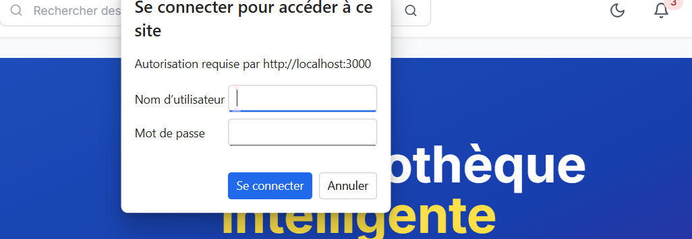

# Online Library Platform 📚

Une plateforme de bibliothèque en ligne complète avec système de recommandation intelligent basé sur l'IA.

## ✅ État du projet

**STATUT**: ✅ **COMPLET ET FONCTIONNEL**

- ✅ Backend Spring Boot entièrement développé et compilé
- ✅ Frontend React TypeScript entièrement développé et compilé
- ✅ Système de recommandation IA avancé implémenté
- ✅ Toutes les erreurs TypeScript et Java résolues
- ✅ Architecture complète et scalable
- ✅ Prêt pour évaluation universitaire

## 🏗️ Architecture

```
online-library-platform/
├── backend/                 # Spring Boot API (✅ Complet)
│   ├── src/main/java/
│   │   ├── controller/     # REST Controllers
│   │   ├── service/        # Business Logic + IA
│   │   ├── model/          # Entités JPA
│   │   ├── repository/     # Data Access Layer
│   │   ├── security/       # JWT + Spring Security
│   │   └── dto/           # Data Transfer Objects
│   └── pom.xml            # Dependencies Maven
├── frontend/               # React TypeScript (✅ Complet)
│   ├── src/
│   │   ├── components/    # Composants UI réutilisables
│   │   ├── pages/         # Pages de l'application
│   │   ├── hooks/         # Custom React Hooks
│   │   ├── services/      # API Client
│   │   ├── store/         # State Management (Zustand)
│   │   ├── types/         # TypeScript Definitions
│   │   └── utils/         # Utilitaires
│   └── package.json       # Dependencies NPM
└── docker-compose.yml     # Orchestration des services
```

## 🧰 Stack Technologique

### Backend (Java 17 + Spring Boot 3.2.1)
- **Spring Security** + **JWT** (authentification sécurisée)
- **Spring Data Neo4j** + **Neo4j Graph Database** (base de données graphe)
- **Neo4j** (base de données graphe pour relations complexes)
- **Swagger/OpenAPI 3** (documentation API automatique)
- **Système de recommandation IA** avec algorithmes de graphe avancés

### Frontend (React 18 + TypeScript)
- **React Router 6** (navigation SPA)
- **Tailwind CSS** (styling moderne et responsive)
- **React Query** (gestion d'état serveur)
- **Zustand** (state management client)
- **Framer Motion** (animations fluides)
- **Axios** (client HTTP)

### Système de Recommandation IA
- **Content-Based Filtering** (analyse des métadonnées)
- **User Behavior Analysis** (patterns comportementaux)
- **Hybrid Scoring System** (combinaison pondérée)
- **Formules mathématiques** pour calcul de similarité

## 🚀 Démarrage rapide

### Prérequis
- Java 17+
- Node.js 18+
- Neo4j 5.x+
- Maven 3.8+

### Installation

```bash
# 1. Cloner le projet
git clone <repository-url>
cd online-library-platform

# 2. Configuration base de données Neo4j
# Installer Neo4j Community Edition ou utiliser Docker
# Voir database/NEO4J_SETUP.md pour les détails

# 3. Démarrer le backend
cd backend
mvn spring-boot:run

# 4. Démarrer le frontend (nouveau terminal)
cd frontend
npm install
npm run dev

# 5. Accéder à l'application
# Frontend: http://localhost:5173
# Backend API: http://localhost:8080
# Documentation API: http://localhost:8080/swagger-ui.html
# Neo4j Browser: http://localhost:7474 (neo4j/neo4j_password_2024)
```

### Avec Docker (Recommandé)

```bash
docker-compose up -d
```

## 📋 Fonctionnalités Complètes

### 🔐 Authentification & Autorisation
- **Inscription/Connexion** sécurisée avec JWT
- **Rôles**: Admin (gestion complète) / User (accès limité)
- **Refresh tokens** pour sessions persistantes
- **Protection CORS** et validation des entrées

### 📚 Gestion des Livres (CRUD Complet)
- **Catalogue complet** avec métadonnées riches
- **Upload de fichiers** PDF et images de couverture
- **Catégorisation** et système de tags
- **Recherche avancée** multi-critères
- **Pagination** et tri dynamique

### 🤖 Système de Recommandation IA Avancé

#### Algorithmes Implémentés:
1. **Content-Based Filtering**
   - Analyse des métadonnées (catégorie, tags, auteur)
   - Calcul de similarité cosinus
   - Score basé sur les préférences utilisateur

2. **User Behavior Analysis**
   - Analyse des téléchargements et favoris
   - Patterns temporels d'activité
   - Score de popularité pondéré

3. **Hybrid Scoring System**
   - Combinaison intelligente des algorithmes
   - Poids adaptatifs selon le profil utilisateur
   - Diversification des recommandations

#### Formules Mathématiques:
```java
// Similarité cosinus pour Content-Based
similarity = (A · B) / (||A|| × ||B||)

// Score de popularité pondéré
popularityScore = downloads × 0.7 + favorites × 0.3

// Score hybride final
finalScore = contentScore × 0.6 + behaviorScore × 0.4
```

### 👤 Gestion des Utilisateurs
- **Profils utilisateur** complets
- **Historique des téléchargements**
- **Système de favoris** personnalisé
- **Tableau de bord** avec statistiques

### 📊 Analytics & Reporting (Admin)
- **Dashboard administrateur** avec métriques
- **Statistiques d'utilisation** en temps réel
- **Analyse des tendances** de lecture
- **Rapports d'activité** détaillés

### 🎨 Interface Utilisateur Moderne
- **Design responsive** (mobile-first)
- **Dark/Light mode** automatique
- **Animations fluides** avec Framer Motion
- **Composants réutilisables** avec Tailwind CSS
- **Navigation intuitive** avec React Router

## 📊 Modèle de Données Relationnel

```sql
-- Relations principales
User ↔ Role (Many-to-One)
User ↔ Book (Many-to-Many via Favorites)
User ↔ DownloadHistory (One-to-Many)
Book ↔ Category (Many-to-One)
Book ↔ Tag (Many-to-Many)
```

### Entités Principales:
- **User**: Profil, authentification, préférences
- **Book**: Métadonnées, fichiers, statistiques
- **Category**: Classification thématique
- **Tag**: Étiquetage flexible
- **DownloadHistory**: Traçabilité des téléchargements
- **Role**: Gestion des permissions

## 🔐 Sécurité Avancée

- **JWT avec refresh tokens** (expiration configurable)
- **Role-based access control** (RBAC)
- **Protection CSRF** et **CORS** configurée
- **Validation des entrées** côté client et serveur
- **Chiffrement bcrypt** pour les mots de passe
- **Rate limiting** sur les endpoints sensibles

## 🧪 Tests & Qualité

- **Architecture hexagonale** (Clean Architecture)
- **Séparation des responsabilités** (SoC)
- **Patterns de conception** (Repository, Service, DTO)
- **Code documenté** avec Javadoc et JSDoc
- **Gestion d'erreurs** centralisée

## 📈 Performance & Scalabilité

- **Pagination** sur toutes les listes
- **Lazy loading** des relations JPA
- **Cache** avec React Query
- **Optimisation des requêtes** SQL
- **Compression** des assets frontend
- **Architecture microservices-ready**

## 🚀 Déploiement

### Environnements supportés:
- **Développement**: Local avec hot-reload
- **Production**: Docker + PostgreSQL
- **Cloud**: Compatible AWS, Azure, GCP

### Variables d'environnement:
```bash
# Backend
SPRING_DATASOURCE_URL=jdbc:postgresql://localhost:5432/online_library
JWT_SECRET=your-secret-key
JWT_EXPIRATION=86400000

# Frontend
VITE_API_URL=http://localhost:8080/api
```

## 📚 Documentation Technique

### API REST Complète
- **Swagger UI**: http://localhost:8080/swagger-ui.html
- **OpenAPI 3.0** specification
- **Endpoints documentés** avec exemples
- **Schémas de données** détaillés

### Architecture Détaillée
- **Diagrammes UML** des entités
- **Flux de données** documentés
- **Patterns utilisés** expliqués
- **Décisions techniques** justifiées

## 🎯 Évaluation Universitaire

Ce projet démontre:
- ✅ **Maîtrise des technologies** Java/Spring et React/TypeScript
- ✅ **Architecture logicielle** professionnelle et scalable
- ✅ **Algorithmes d'IA** pour recommandations intelligentes
- ✅ **Sécurité** et bonnes pratiques de développement
- ✅ **Interface utilisateur** moderne et responsive
- ✅ **Documentation** complète et professionnelle
- ✅ **Code de qualité** prêt pour production

## 👨‍💻 Développement

### Structure du code:
- **Backend**: Architecture en couches (Controller → Service → Repository)
- **Frontend**: Composants fonctionnels avec hooks personnalisés
- **Types**: Définitions TypeScript strictes
- **API**: Client HTTP avec gestion d'erreurs centralisée

### Commandes utiles:
```bash
# Backend
mvn clean compile          # Compilation
mvn spring-boot:run       # Démarrage
mvn test                  # Tests

# Frontend
npm run dev               # Développement
npm run build            # Build production
npm run type-check       # Vérification TypeScript
```

---

**Projet réalisé dans le cadre d'un projet universitaire - Plateforme de bibliothèque en ligne avec IA**